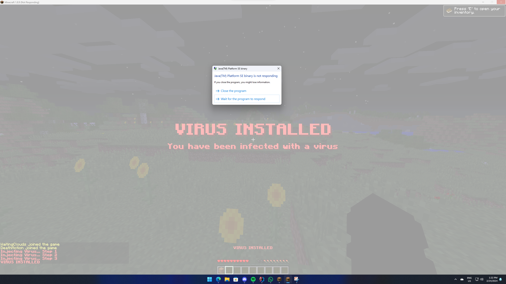

[](https://github.com/Bram1903/MinecraftPlayerCrasher/actions/workflows/gradle.yml)
[](https://github.com/Bram1903/MinecraftPlayerCrasher/actions/workflows/codeql.yml)

# Minecraft Player Crasher Plugin

A simple Minecraft plugin to crash a player using a command.



## Supported Versions

This plugin supports every Minecraft version from 1.8.8 to 1.20.4.
Besides that, the plugin also supports Spigot, Paper, and Folia.

Technically, it should also work on any Spigot or Paper fork, but I can't guarantee that statement.

## Features

- **Completely Asynchronous** - The plugin is designed to be as lightweight as possible.
  All packet modifications are done asynchronously, so the main thread is never blocked.
- **Folia Support** - The plugin integrates with [Folia](https://papermc.io/software/folia), which is a Paper fork that
  adds regionised multithreading to the server.
- **Scare Command** - The plugin includes a scare command, which makes the target think they are receiving a virus. 
After sending a few messages to the target, the target will be crashed like normal
  (See the picture in the top of this README).
- **Configurable** - The plugin is highly configurable, allowing you to adjust the settings to your liking.
- **Update Checker** - The plugin automatically checks for updates on startup.
  If a new version is available, a message will be sent to the console.
- **Stand Alone** - The plugin is completely stand alone, meaning it doesn't require any other plugins to function.
- **Permission Bypass** - The bypass permission  (`PlayerCrasher.Bypass`), prevents a player from being crashed.

## Usage/Examples

- `/crash (player) [Method]`
- `/scarecrash (player) [Method]`

> **Note:** The method parameter is optional. If no method is provided, the plugin will use the default method, which is all.

**Methods:**

- `Position`
- `Explosion`
- `Particle`

**Note:** When providing `All` as the method, the plugin will use all methods to crash the player. This is also the default method used when no method is provided.

## Permission Nodes

Players that are OP (Operators) have these permissions by default.

- `PlayerCrasher.Crash` Allows the player to use the /crash command.
- `PlayerCrasher.Crash.Scare` Allows the player to use the /scarecrash command, which makes the target think they are
  receiving a virus.
- `PlayerCrasher.Bypass` Exempts the player from being crashed when the /crash command is used on them.
- `PlayerCrasher.Alerts` Makes the player receive alerts when a player is being crashed by another player.
- `PlayerCrasher.UpdateNotify` Makes the player receive an update notification when a new version is available.

## Installation Guide

1. [Download the latest release](https://github.com/Bram1903/MinecraftPlayerCrasher/releases/latest) from the release
   page.

2. Move the downloaded plugin to the plugins directory of your server.

3. Restart your server for the changes to be implemented.

4. Adjust the presets in the `config.yml` file to match your preferences. (Restart required)

5. You're good to go!

## Compiling Jar From Source

> Prerequisites

- Java 17 or higher
- Gradle

To compile the jar from source, run the following command in the directory of your project root (i.e., where the
build.gradle file resides).

```bash
gradle build
```

The produced jar can be located in the /build/libs/ directory within your project root.

## License

[MIT](https://choosealicense.com/licenses/mit/)
