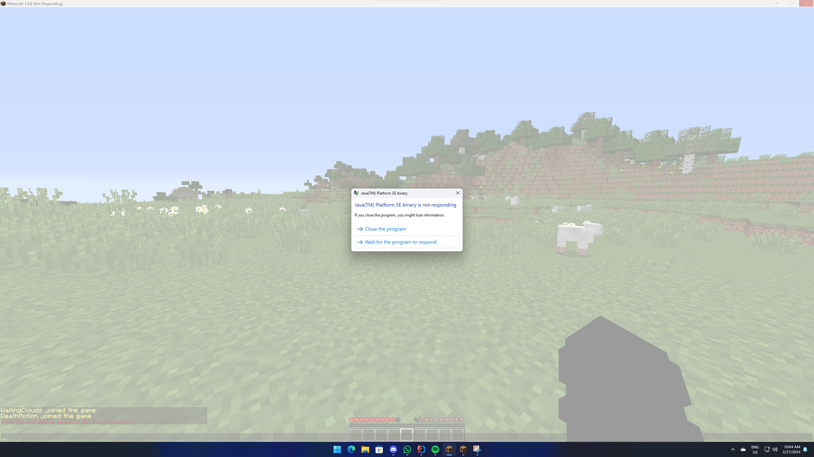

[](https://github.com/Bram1903/MinecraftPlayerCrasher/actions/workflows/gradle.yml)
[](https://github.com/Bram1903/MinecraftPlayerCrasher/actions/workflows/codeql.yml)


[](https://modrinth.com/plugin/playercrasher)

# Minecraft Player Crasher Plugin

An easy-to-use Minecraft plugin that enables the crashing of a player's game through the use of a command.



## Dependency

PacketEvents is a required dependency for this plugin to function. You can download the latest version of PacketEvents
from the following link:
https://ci.codemc.io/job/retrooper/job/packetevents/lastSuccessfulBuild/artifact/spigot/build/libs/packetevents-spigot-2.2.1.jar

## Supported Versions

This plugin supports every Minecraft version from 1.8.8 to 1.20.6.
Besides that, the plugin also supports Spigot, Paper, and Folia.

Technically, it should also work on any Spigot or Paper fork, but I can't guarantee that statement.

## Features

- **Completely Asynchronous** - The plugin is designed to be as lightweight as possible.
  All packet modifications are done asynchronously, so the main thread is never blocked.
- **Folia Support** - The plugin integrates with [Folia](https://papermc.io/software/folia), which is a Paper fork that
  adds regionised multithreading to the server.
- **Configurable** - The plugin is highly configurable, allowing you to adjust the settings to your liking.
- **Update Checker** - The plugin automatically checks for updates on startup.
  If a new version is available, a message will be sent to the console.
- **Permission Bypass** - The bypass permission  (`PlayerCrasher.Bypass`), prevents a player from being crashed.

## Usage/Examples

- `/crash (player) [Method]`

> **Note:** The method parameter is optional. If no method is provided, the plugin will use the default method, which is
> all.

**Methods:**

- `Position`
- `Explosion`
- `Particle`

**Note:** When providing `All` as the method, the plugin will use all methods to crash the player. This is also the
default method used when no method is provided.

## Permission Nodes

Players that are OP (Operators) have these permissions by default.

- `PlayerCrasher.Crash` Allows the player to use the /crash command.
- `PlayerCrasher.Bypass` Exempts the player from being crashed when the /crash command is used on them.
- `PlayerCrasher.Alerts` Makes the player receive alerts when a player is being crashed by another player.
- `PlayerCrasher.UpdateNotify` Makes the player receive an update notification when a new version is available.

## Installation Guide

1. [Download the latest release](https://github.com/Bram1903/MinecraftPlayerCrasher/releases/latest) from the release
   page.

2. Move the downloaded plugin to the plugins directory of your server.

3. Restart your server for the changes to be implemented.

4. Adjust the presets in the `config.yml` file to match your preferences. (Restart required)

5. You're good to go!

## Compiling From Source

### Prerequisites

- Java Development Kit (JDK) version 8 or higher

### Steps:

1. **Clone the Repository**:
   Clone the repository containing the MinecraftPlayerCrasher source code to your local machine using Git:
   ```bash
   git clone https://github.com/Bram1903/MinecraftPlayerCrasher.git
   ```

2. **Navigate to Project Directory**:
   Change your current directory to the root directory of the cloned project:
   ```bash
   cd MinecraftPlayerCrasher
   ```

3. **Compile the Source Code**:
   Use the Gradle wrapper to compile the source code and generate the plugin JAR file:
   <details>
   <summary><strong>Linux / macOS</strong></summary>

   ```bash
   ./gradlew build
   ```
   </details>
   <details>
   <summary><strong>Windows</strong></summary>

   ```cmd
   .\gradlew build
   ```
   </details>

## License

This project is licensed under the [GPL3 License](LICENSE).
